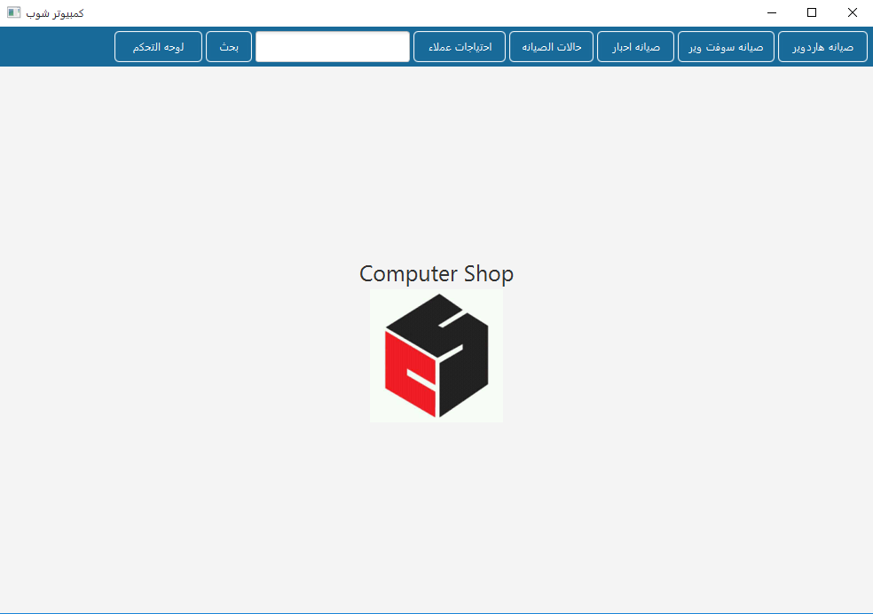
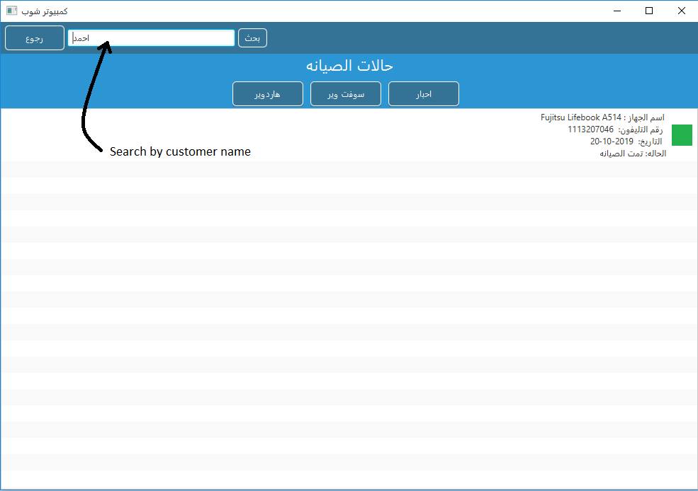

# Maintenance Management

## Desktop App to Manage Computer Maintenance Process

### Features
 
1 - Print Bill
 
2 - Elastic Search
 
3 - Edit / Add Bill
 
4 - Add Hardware Device
 
5 - Add Software Device
 
6 - Add Printer Device
 

### Technologies
1 - JavaFx
 
2 - FXML
 
3 - MySql Database
 
4 - PHP
 

### Images
 

  
  
  
  
  
  
  
   
  Search by Customer name
  
   

